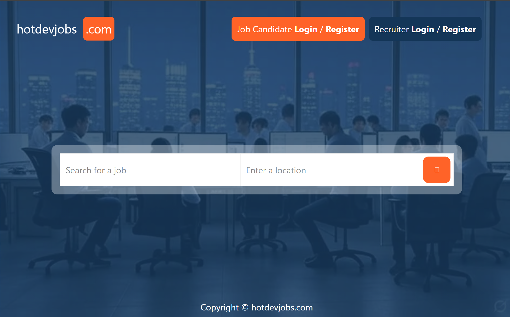
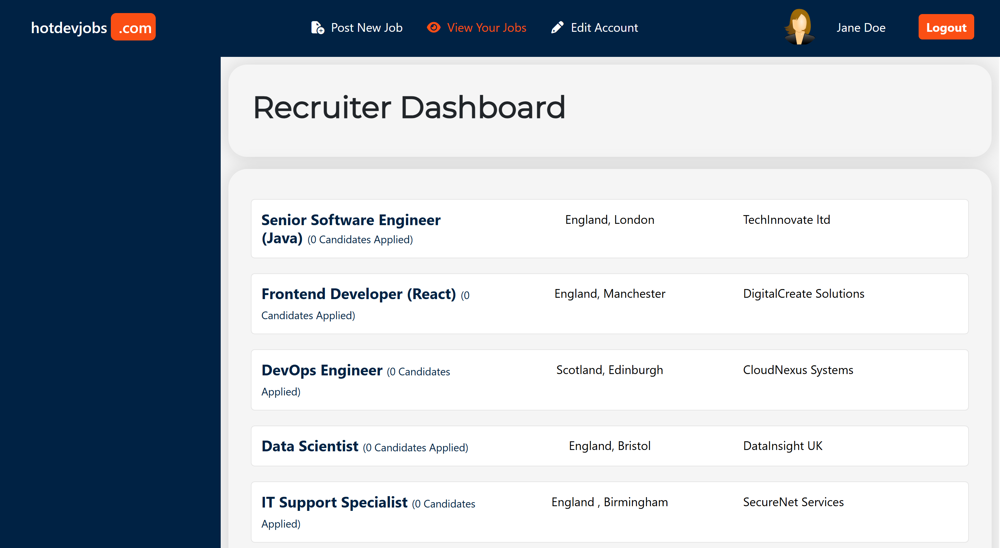
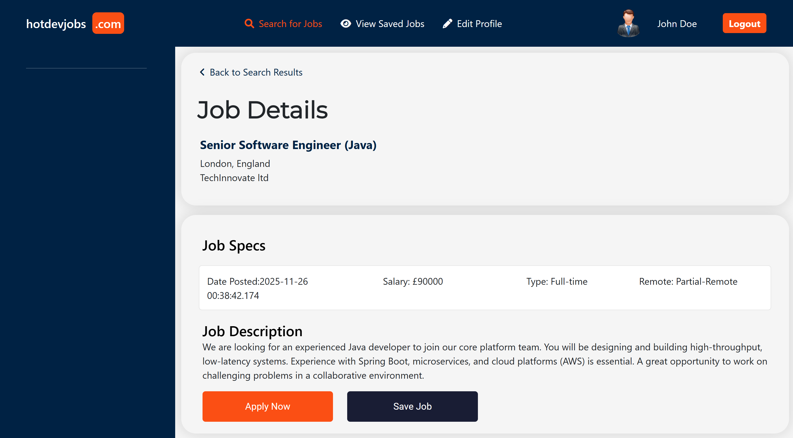
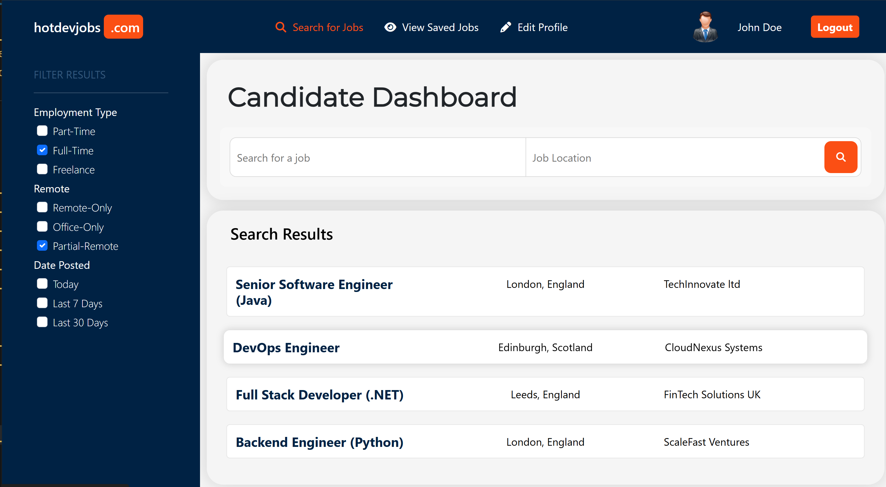
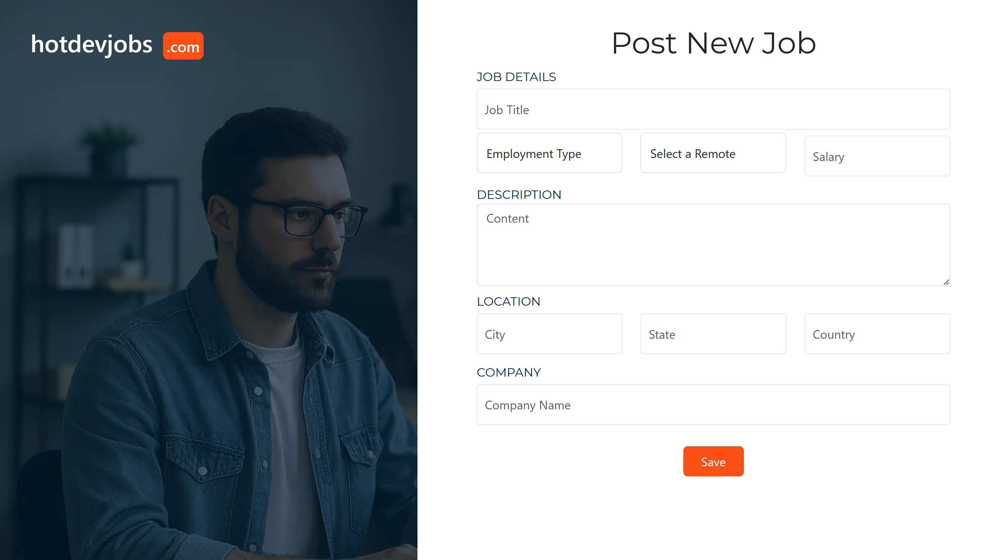
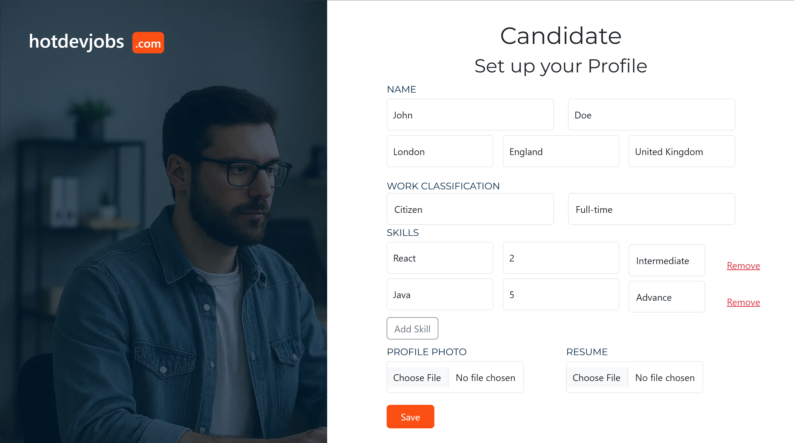
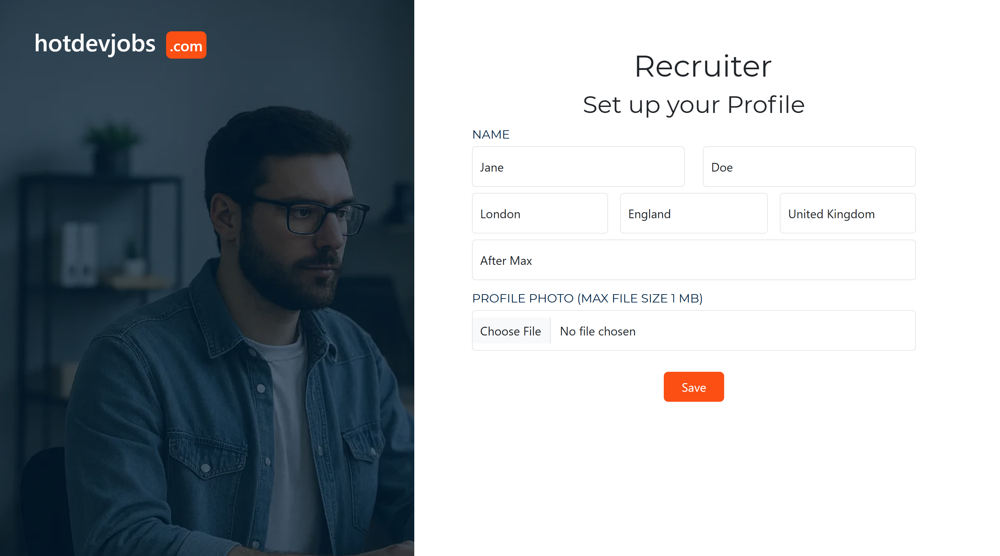

# HotDevJobs – Job Portal Web Application

A full-stack job portal application built with **Spring Boot 3**, **Spring Security**, **Thymeleaf**, and **MySQL**, enabling seamless interaction between **job seekers** and **recruiters**.

This project follows a complete end-to-end architecture typical in modern enterprise Java applications, demonstrating authentication, file uploads, relational database modelling, MVC pattern, and role-based dashboards.

---

# 📸 Screenshot Gallery (Quick Overview)

<p align="center">
  
  
  
</p>

<p align="center">
  
  
  
</p>

<p align="center">
  
  
  
</p>

---

# 🧭 Table of Contents

- [Overview](#overview)
- [Features](#features)
- [Architecture](#architecture)
- [Technology Stack](#technology-stack)
- [Project Structure](#project-structure)
- [Screenshots & Feature Walkthrough](#screenshots--feature-walkthrough)
- [Database Schema](#database-schema)
- [Installation & Setup](#installation--setup)
- [Future Enhancements](#future-enhancements)
- [Author](#author)

---

# 🧾 Overview

**HotDevJobs** is a full-featured job portal where:

- **Recruiters** can post jobs, manage listings, and review applicants.
- **Job Seekers** can create profiles, upload CVs, search for jobs, apply, and save favourite roles.

Built as a portfolio project, this application demonstrates:

- Spring Boot best practices  
- Layered architecture (Controller → Service → Repository)  
- Form handling & validation  
- File upload & download  
- Role-based authentication  
- MySQL relational modelling  
- MVC UI with Thymeleaf  

---

# ⭐ Features

## 👤 Job Seeker Features
- Register & login (Job Seeker role)
- Create & edit profile (skills, location, work classification)
- Upload profile photo & CV
- Search for jobs by keyword/location
- Detailed job view with specs
- Apply for job postings
- Save favourite jobs for later
- View applied jobs

## 🧑‍💼 Recruiter Features
- Register & login (Recruiter role)
- Create & manage job postings
- Edit account settings
- View list of jobs posted
- See a list of candidates per job
- Download candidate CVs

## 🔐 Security
- Spring Security authentication
- Role-based routing & access control
- Password hashing
- Custom authentication success handler

---

# 🏗️ Architecture

This application uses a standard, production-grade **Spring MVC architecture**:


**Layers:**
- **Controller:** Handles HTTP requests  
- **Service:** Business logic  
- **Repository:** JPA/Hibernate data access  
- **View:** Thymeleaf templates  

---

# 🛠️ Technology Stack

### **Backend**
- Java 21  
- Spring Boot 3.5.x  
- Spring MVC  
- Spring Security  
- Spring Data JPA (Hibernate)  
- MySQL 8  
- Maven  

### **Frontend**
- Thymeleaf  
- HTML5, CSS3  
- Bootstrap  
- jQuery  
- Font Awesome  

### **Tools**
- IntelliJ IDEA Ultimate  
- MySQL Workbench  
- Git & GitHub  

---

# 📁 Project Structure

```
src/
└─ main/
   ├─ java/uk/gitsoft/jobportal/
   │   ├─ config/
   │   │   ├─ CustomAuthenticationSuccessHandler.java
   │   │   ├─ MvcConfig.java
   │   │   └─ WebSecurityConfig.java
   │   ├─ controller/
   │   │   ├─ HomeController.java
   │   │   ├─ JobPostActivityController.java
   │   │   ├─ JobSeekerApplyController.java
   │   │   ├─ JobSeekerProfileController.java
   │   │   ├─ JobSeekerSaveController.java
   │   │   ├─ RecruiterProfileController.java
   │   │   └─ UsersController.java
   │   ├─ entity/
   │   │   ├─ RecruiterJobs.java
   │   │   ├─ JobCompany.java
   │   │   ├─ JobLocation.java
   │   │   ├─ JobPostActivity.java
   │   │   ├─ JobSeekerApply.java
   │   │   ├─ JobSeekerProfile.java
   │   │   ├─ JobSeekerSave.java
   │   │   ├─ RecruiterJobsDto.java
   │   │   ├─ RecruiterProfile.java
   │   │   ├─ Skills.java
   │   │   ├─ Users.java
   │   │   └─ UserType.java
   │   ├─ repository/
   │   │   ├─ JobPostActivityRepository.java
   │   │   ├─ JobSeekerApplyRepository.java
   │   │   ├─ JobSeekerProfileRepository.java
   │   │   ├─ JobSeekerSaveRepository.java
   │   │   ├─ RecruiterProfileRepository.java
   │   │   ├─ SkillsRepository.java
   │   │   ├─ UsersRepository.java
   │   │   └─ UsersTypeRepository.java
   │   ├─ services/
   │   │   ├─ CustomUserDetailsService.java
   │   │   ├─ JobPostActivityService.java
   │   │   ├─ JobSeekerApplyService.java
   │   │   ├─ JobSeekerProfileService.java
   │   │   ├─ JobSeekerSaveService.java
   │   │   ├─ RecruiterProfileService.java
   │   │   ├─ UsersService.java
   │   │   └─ UsersTypeService.java
   │   ├─ util/
   │   │   ├─ CustomUserDetails.java
   │   │   ├─ FileDownloadUtil.java
   │   │   └─ FileUploadUtil.java
   │   └─ JobportalApplication.java
   ├─ resources/
   │   ├─ static/ 
   │   ├─ templates/ 
   │   └─ application.properties
   └─ test/
```

---

# 📸 Screenshots & Feature Walkthrough

## 🏠 Home Page  


---

## 📝 User Registration  


---

## 👤 Candidate Profile Setup  


---

## 📊 Candidate Dashboard  


---

## 📄 Job Details Page  


---

## 🧑‍💼 Recruiter Dashboard  


---

## 🧾 Recruiter Profile Page  


---

## 📝 Post a New Job  


---

# 🧩 Database Schema

Key entities:
- `Users` + `UserType`
- `JobSeekerProfile`
- `RecruiterProfile`
- `Skills`
- `JobPostActivity`
- `JobCompany`
- `JobLocation`
- `JobSeekerApply`
- `JobSeekerSave`

---

# 🧰 Installation & Setup

### 1. Clone the repository
```bash
git clone <your-repo-url>
cd jobportal
```

### 2. Create MySQL Database

```sql
CREATE DATABASE jobportal;
CREATE USER 'jobportal'@'localhost' IDENTIFIED BY 'jobportal';
GRANT ALL PRIVILEGES ON jobportal.* TO 'jobportal'@'localhost';
FLUSH PRIVILEGES;
```

### 3. Configure properties
```
spring.datasource.url=jdbc:mysql://localhost:3306/jobportal
spring.datasource.username=jobportal
spring.datasource.password=jobportal
```

### 4. Run the application
```bash
mvn spring-boot:run
```

---

# 🔮 Future Enhancements

- Pagination & advanced filters  
- Email notifications  
- Store images & CVs in AWS S3  
- Deploy on AWS (ECS / Elastic Beanstalk)  
- REST API version  
- Job recommendation engine  

---

# 👨‍💻 Author

**Bogdan Duchnowski**  
Portfolio Project – Job Portal (HotDevJobs)
